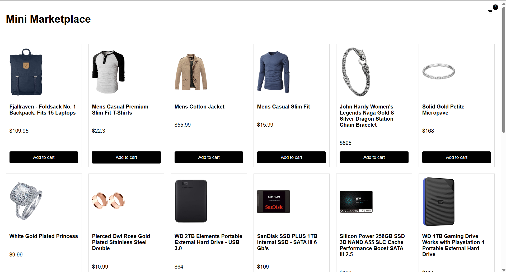
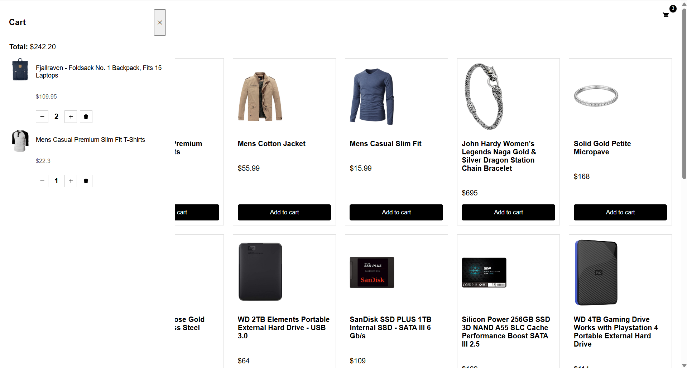

Имя: Мадияр

Сколько времени заняло: Около 5-6 часов 

Что было сложным: Разделить React и Vanilla JS в одном приложении
Реализовать корректное взаимодействие между каталогом и корзиной
Продумать и реализовать выезжающую корзину без использования UI-библиотек.

